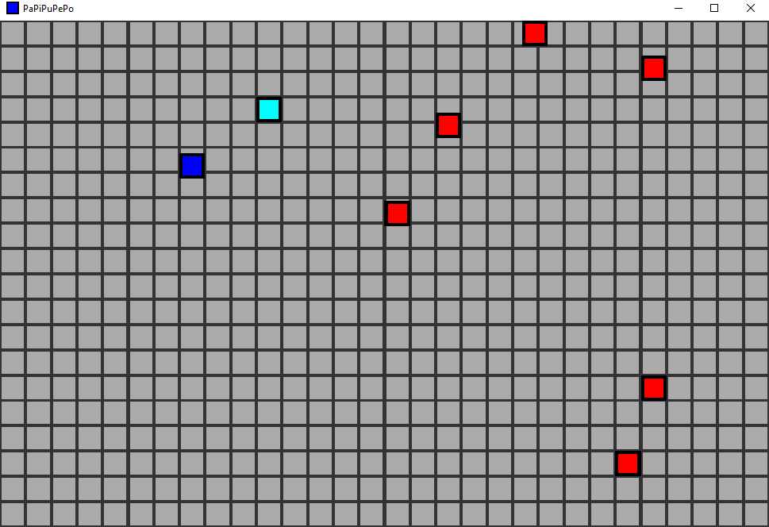

# PaPiPuPePo 

A very simple game that I built years ago when toying around with C++ game creation.
The code has been touched up a wee bit and some of the comments rephrased but the gameplay and base mechanics haven't changed.

As I built this years ago there are a few things which are inefficent/sub-optimal and if I were to start over I would definently do differently.
Such as the bare-bones use of win32's stretchBlt function with a CPU set pixel buffer for the graphics or the way that the game clock works.
However I don't really want to waste more time on a old and simple game when I have other more interesting projects to work on.
The only reason I've pushed this to github is to help build up a portfolio :)

The game itself is named after the Japanese vowel sounds when combined with the consonant P,
no particular reason other than it sounds kind of funny (at least when I'm practicing hiragana aloud lol)

Pa ぱ, Pi ぴ, Pu ぷ, Pe ぺ, Po ぽ

---

## Gameplay

You play as the blue square and have to collect coins (cyan squares) without being caught by any of the bad guys (red squares).
For every coin you collect you score a point but a new bad guy spawns in making the game slightly harder!

### Controls

All movement is grid locked, (you move from square to square and can't rest between them)

W ⇒ move up

S ⇒ move down

A ⇒ move left

D ⇒ move right

The game ends when you are either caught by a red square or you close the window

---

## Important

### Game speed and rendering

The game speed and rendering is attached to a bare-bones timer system, see lines 146/147 of entry.cpp.
The game speed seems to run faster on higher performance machines, as such I've uploaded a version with a longer gameloop wait time.
(I'd rather the game was slower on weaker machines than too fast and flashy on stronger machines).

But I've included the Code::Blocks project so you can easily modify the line and recompile the project for your machine.
( hold > release + x, higher values of x make the game slower, lower values of x make the game faster).

If I were to do this project again I'd use something like glfw and use their timer system,
but again I don't want to waste anymore time on a game that was built years ago to test the waters of C++ game making.

### License

I'm releasing this project completely open source using the unlicense template: https://unlicense.org/

A grid locked square move around game isn't exactly a hard idea to come up with and implement,
so I don't see any point licensing the game with a stricter copyright/left license.

The unlicense website recommends adding some extra terms regarding major contributors and what not.
I'm not going to bother with anything like that for 2 reasons:

- Only I will be contributing to this specific repository

- It's a very basic game that anyone could come up with and create, I don't care if you make your own copy, recompile, modifiy, sell, etc. Just make sure you acknowledge the capialised part of the license file (see below)

THE SOFTWARE IS PROVIDED "AS IS", WITHOUT WARRANTY OF ANY KIND,
EXPRESS OR IMPLIED, INCLUDING BUT NOT LIMITED TO THE WARRANTIES OF
MERCHANTABILITY, FITNESS FOR A PARTICULAR PURPOSE AND NONINFRINGEMENT.
IN NO EVENT SHALL THE AUTHORS BE LIABLE FOR ANY CLAIM, DAMAGES OR
OTHER LIABILITY, WHETHER IN AN ACTION OF CONTRACT, TORT OR OTHERWISE,
ARISING FROM, OUT OF OR IN CONNECTION WITH THE SOFTWARE OR THE USE OR
OTHER DEALINGS IN THE SOFTWARE.

To view the license itself see LICENSE.md, or look at the top of each .cpp, .h and .rc file where it exists as a comment!

